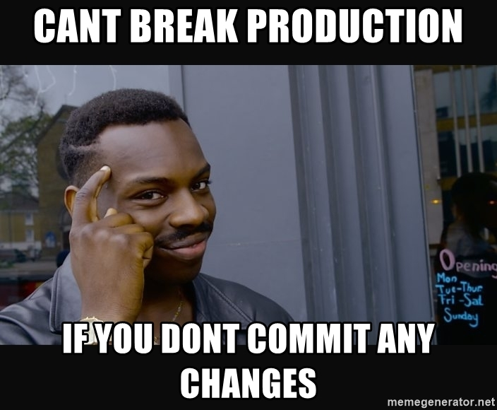

# Commits

## What is it?
Simply put, **Commits** are saved changes. 

## Commits Explained
Each commit has an associated _commit message_. A **good _commit message_** is a description why a particular change was made or the changes themselves.

Git assigns each commit a unique ID, called a SHA or hash, that identifies:
* The specified changes
* When the changes were made
* Who created the changes

## Command
`git commit -m "<A descriptive change>"`

## Funny Commit meme

> Commits that are meaningful and make the repo better are wonderful ;)

* Hmm, surely there must be a way to commit to a repo without breaking anything that might be really important. 

---

[next](branches.md)
