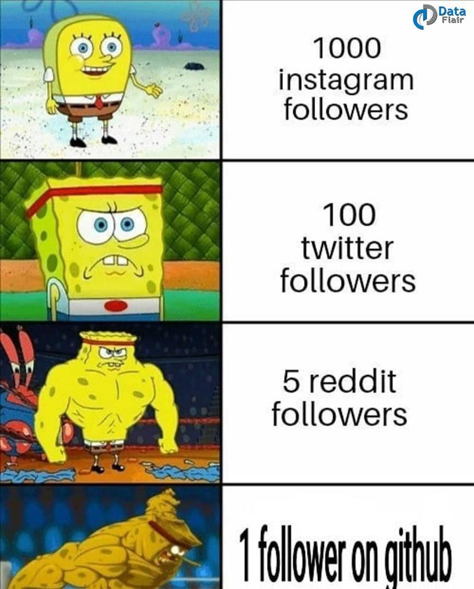

# Conclusion

Hope you are sold on Github! 

Git is an incredibly powerful tool that can help you build anything that might interest you! 

With Github and Git by your side, you are virtually unstoppable when it comes to **Software Development** and **Product Development**! 

Feel free to come on and try it for yourself! Or look into the [Advanced Github Techniques](https://github.com/njitacm/advanced-github-workshop) (if you up for the challenge)

> Also, highly recommend looking at github memes, sometimes very funny

## Resources
* [Why Git Sucks and you'll use it anyways](https://www.slideshare.net/CarlosTaborda/why-git-sucks-and-youll-use-it-anyways)
    * After Slide 21, it actually has some meaning stuff that will help with understanding the fundamentals

---

[start over](../README.md)