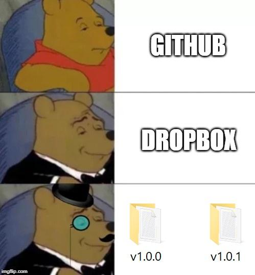
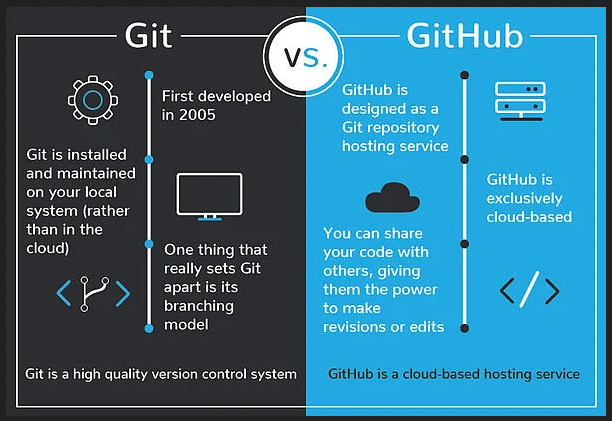

# Git & Version Control

## Decoupling the Git in Github

### Github and Git are 2 different things

**Git**  is  the  free  and  open  source  distributed  version  control  system  that's  responsible  for  everything  GitHub related that happens locally on your computer.

**Github** is a code hosting platform for version control and collaboration. It lets you and others work together on projects from anywhere.

---

## Version Control?
Version Control goes by many names:
* Revision Control
* Source Control
* Source Code Management

Version Control is a sclass of systems responsible for managing changes to any type of DATA.
* Code
* Documents
* Backend Infrastructure
* Collection of information
* Executables / Programs
* Anything that can be on a computer can be on Github

> But what does it actually mean?
* As long as you push to Github, your code is saved. 
    * But not only your code, your entire history of your code is saved. 

* You can work with your code without worrying about messing anything up
    * Via Branching, you can your main production branch and also a feature branch so if you mess anything up you, you don't actually mess anything up

---

[next](commits.md)
