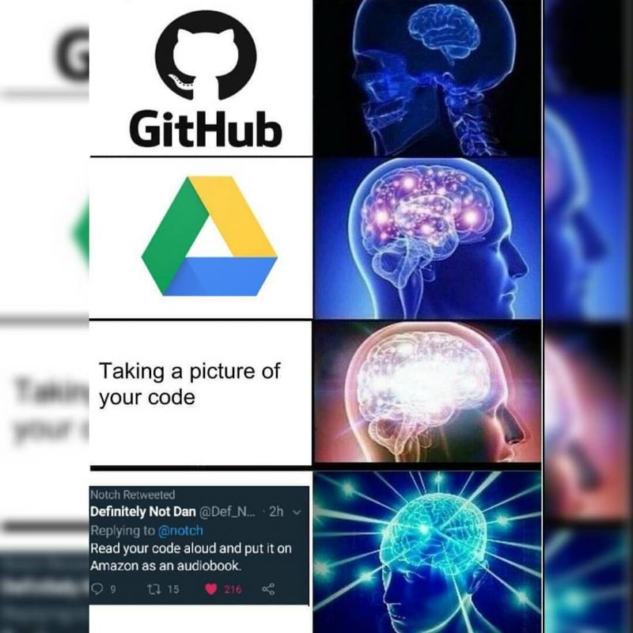
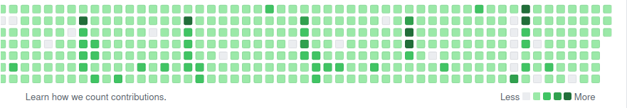

# why?
Why not?

**GitHub** is a website for **developers** and **programmers** to collaboratively work on code. The primary benefit of **GitHub** is its version control system, which allows for seamless collaboration without compromising the integrity[1](#f1) of the original project. The projects on GitHub are examples of open-source software.

1 Some `l33t` hackers can manipulate integrity on Github. 

* Check out Contributors on [SigMal](https://github.com/AOrps/SigMal)
    * One of them seems like they don't quite fit

## Benefits

* Github as a 'Code Portfolio'
    * Show off your technical and coding expertise

* Build Software Engineering Products
    * Lots of production Code is on Github (i.e. Linux Kernel, cpython, snort3, etc)

* For those ***BEAUTY GREEN SQUARES*** that make contribution

Just note there is always another person, with more commits than you!

* Also use it as a place for information
    * [Red Teaming Toolkit](https://github.com/infosecn1nja/Red-Teaming-Toolkit)
    * [Zero-to-mastery/start-here-guidelines](https://github.com/zero-to-mastery/start-here-guidelines)
    * [SigMal](https://github.com/AOrps/SigMal)
    * [Awesome OSCP](https://github.com/0x4D31/awesome-oscp)

---

[next](gitVC.md)
